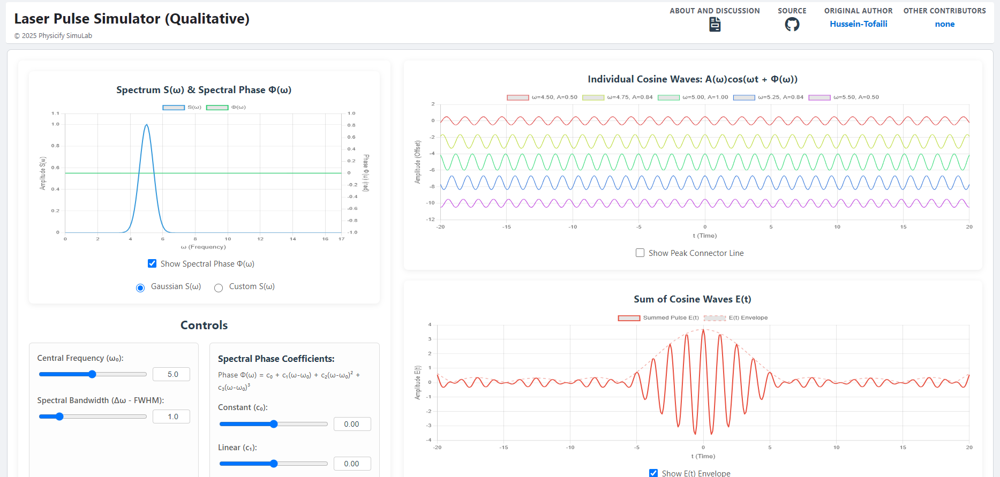

# Laser Pulse Simulator (Qualitative)

Welcome to the **Laser Pulse Simulator**, a web-based interactive tool for visualizing the formation of a laser pulse from its constituent frequencies. This simulator qualitatively demonstrates how the spectral amplitude and phase of continuous waves determine the final temporal shape and intensity of a pulse.

*Screenshot of the simulator interface, showing the spectral and temporal plots.*

---

## 🚀 Live Demo

**[Click here to launch the simulator!](https://physicify-simulab.github.io/LaserPulseSimulator/)**

---

## 📖 About This Simulator

This tool is designed for students, educators, and researchers interested in optics and photonics. It provides an intuitive platform to understand complex concepts related to ultrashort laser pulses without requiring complex quantitative analysis.

The core principle is the visualization of the Fourier relationship between the spectral and temporal domains. The temporal electric field, $E(t)$, is calculated as the sum of individual cosine waves, where their amplitudes $A(\omega)$ and phases $\Phi(\omega)$ are defined in the frequency domain.

Key concepts you can explore include:
* **Pulse Formation**: See how a coherent sum of waves creates a localized pulse of light.
* **Group Delay (GD)**: Observe how the pulse position shifts by adjusting the linear phase term ($c_1$).
* **Group Delay Dispersion (GDD)**: See how the pulse broadens or compresses by adjusting the quadratic phase term ($c_2$), a phenomenon known as chirp.
* **Higher-Order Dispersion**: Investigate the effects of the cubic phase term ($c_3$) on the pulse shape, leading to asymmetry and satellite pulses.

---

## ✨ Features

* **Interactive Plots**: Four linked plots provide a comprehensive view of the pulse:
    1.  **Spectrum S(ω) & Spectral Phase Φ(ω)**: The input plot where you define the pulse in the frequency domain.
    2.  **Individual Cosine Waves**: A visual breakdown of the continuous waves being summed.
    3.  **Sum of Cosine Waves E(t)**: The resulting temporal electric field of the pulse.
    4.  **Sum Intensity I(t)**: The pulse's intensity, proportional to $E(t)^2$.
* **Two Spectrum Modes**:
    * **Gaussian**: A standard, idealized spectrum defined by a central frequency ($\omega_0$) and bandwidth (FWHM).
    * **Custom**: Drag and drop points to create any spectral amplitude shape you want.
* **Full Phase Control**: Manipulate the spectral phase using a Taylor series expansion up to the third order:
    $$ \Phi(\omega) = c_0 + c_1(\omega-\omega_0) + c_2(\omega-\omega_0)^2 + c_3(\omega-\omega_0)^3 $$
* **Visualization Toggles**: Enable or disable envelopes, the spectral phase plot, and a peak connector line for clearer analysis.
* **Responsive Design**: The simulator is fully usable on both desktop and mobile devices.

---

## 🛠️ How to Use

1.  **Launch the Simulator**: Open the [live demo link](https://physicify-simulab.github.io/LaserPulseSimulator/).
2.  **Select a Spectrum Mode**:
    * Choose **Gaussian S(ω)** and use the sliders to set the Central Frequency (`ω₀`) and Spectral Bandwidth (`Δω`).
    * Or, choose **Custom S(ω)** and drag the red dots on the top-left chart to define a custom spectrum shape.
3.  **Adjust the Spectral Phase**:
    * Use the "Spectral Phase Coefficients" sliders to control the constant (`c₀`), linear (`c₁`), quadratic (`c₂`), and cubic (`c₃`) phase terms.
4.  **Observe the Results**:
    * The plots will update in real-time to show how your changes to the spectrum and phase affect the individual waves and the final pulse shape, position, and intensity.

---

## 💻 Technologies Used

* **HTML5**: The structure of the web application.
* **CSS3**: Styling for a modern and responsive user interface.
* **JavaScript (ES6+)**: The core logic for all calculations and interactivity.
* **Chart.js**: A powerful library used for creating the interactive and dynamic plots.

---

## 🤝 Feedback & Contributions

We appreciate your feedback! If you find any bugs or have suggestions for new features, please open an issue on the [GitHub Issues page](https://github.com/physicify-simulab/LaserPulseSimulator/issues).

---

## ✒️ Author

This project was originally created by **Hussein-Tofaili** and is now maintained under the **Physicify SimuLab** project and is licensed under MIT.

* **Original Author**: [Hussein-Tofaili](https://github.com/Hussein-Tofaili)
* **GitHub Repository**: [physicify-simulab/LaserPulseSimulator](https://github.com/physicify-simulab/LaserPulseSimulator)